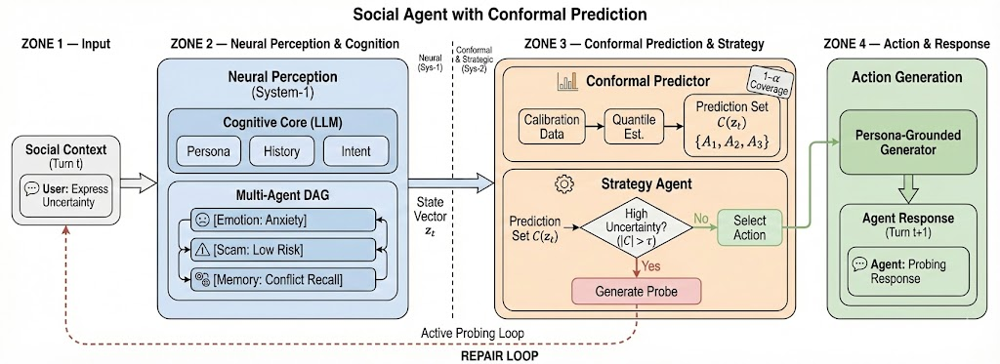
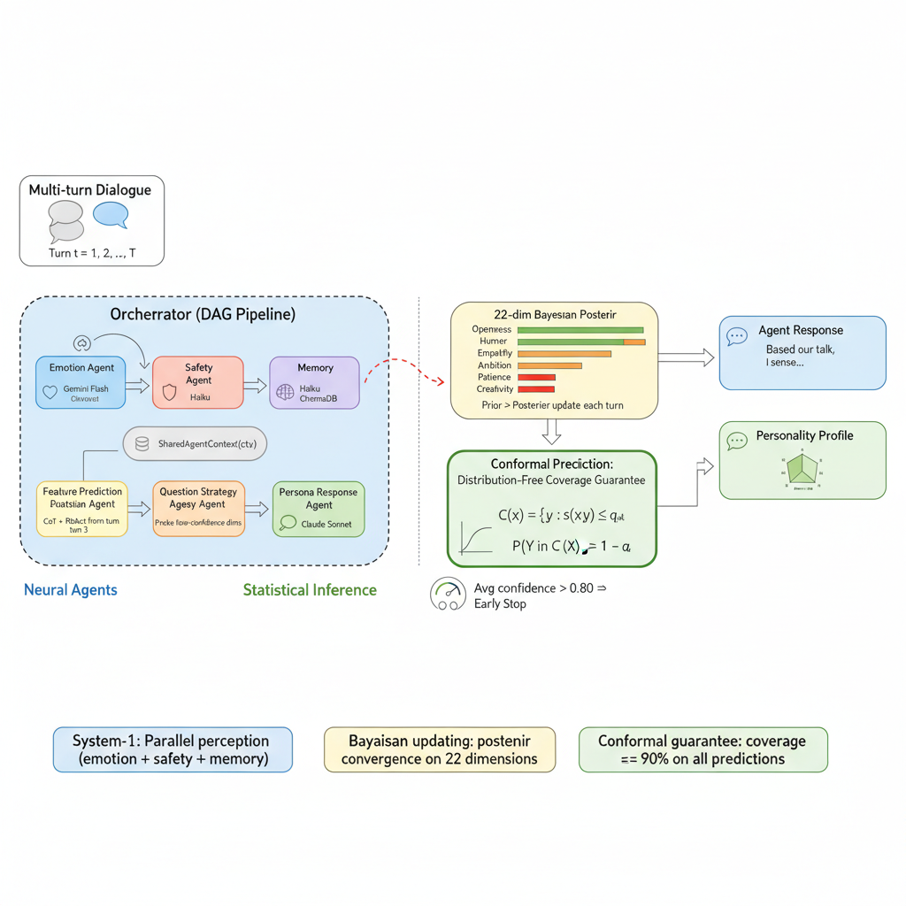

# SoulMatch Agent v2.0

**Multi-Agent Relationship Prediction System**

A multi-agent orchestration system with **12 collaborative agents**, **Bayesian feature inference**, **conformal uncertainty quantification**, and **three-layer cognitive memory**. This is not a single-LLM chatbot — agents run in parallel, share context through a blackboard, and adaptively steer conversations based on statistical uncertainty.


**Live Demo**: [huggingface.co/spaces/Quinnnnnne/SoulMatch-Agent](https://huggingface.co/spaces/Quinnnnnne/SoulMatch-Agent)

---

## Architecture Overview





Each user message triggers a 5-phase DAG pipeline — not a simple sequential chain, but a directed acyclic graph with data dependencies:

```
User Message
     │
     ▼
┌─────────────────────────────────────────────────┐
│  Phase 1 — PARALLEL (asyncio.gather)            │
│  ┌──────────┐ ┌──────────────┐ ┌─────────────┐  │
│  │ Emotion  │ │ Scam         │ │ Memory      │  │
│  │ Agent    │ │ Detection    │ │ Retrieval   │  │
│  └────┬─────┘ └──────┬───────┘ └──────┬──────┘  │
└───────┼──────────────┼────────────────┼──────────┘
        │              │                │
        ▼              ▼                ▼
   SharedAgentContext (blackboard writes)
        │
        ▼
┌─────────────────────────────────────────────────┐
│  Phase 2 — SEQUENTIAL                           │
│  Feature Prediction → Bayesian Update           │
│  → Conformal Calibration (APS)                  │
└────────────────────┬────────────────────────────┘
                     │
                     ▼
┌─────────────────────────────────────────────────┐
│  Phase 3 — SEQUENTIAL                           │
│  Question Strategy (reads low-confidence list)  │
└────────────────────┬────────────────────────────┘
                     │
                     ▼
┌─────────────────────────────────────────────────┐
│  Phase 4 — SEQUENTIAL                           │
│  Bot Response (persona + probes + context)      │
└────────────────────┬────────────────────────────┘
                     │
                     ▼
┌─────────────────────────────────────────────────┐
│  Phase 5 — SEQUENTIAL                           │
│  Memory Store + Relationship Prediction (5-turn)│
└─────────────────────────────────────────────────┘
```

---

## 8 Architectural Highlights

### 1. Pipeline DAG Execution

The orchestrator (`src/agents/orchestrator.py`) coordinates 12 agents through a 5-phase DAG. Phase 1 runs three independent agents concurrently via `asyncio.gather`; subsequent phases consume upstream results through the shared context. This is a genuine parallel + sequential DAG — not a flat chain.

### 2. SharedAgentContext (Blackboard Pattern)

A single mutable dataclass (`src/agents/agent_context.py`) with 80+ fields flows through every agent each turn. Fields span emotion state, 22-dim feature predictions, memory summaries, scam risk scores, tool results, discussion synthesis, and relationship snapshots. Agents read upstream results and write their own outputs — zero direct inter-agent coupling.

```python
@dataclass
class AgentContext:
    # Emotion (written by EmotionAgent)
    current_emotion: Optional[str] = None
    emotion_confidence: float = 0.0
    # Features (written by FeaturePredictionAgent)
    predicted_features: dict[str, Any] = field(default_factory=dict)
    feature_confidences: dict[str, float] = field(default_factory=dict)
    low_confidence_features: list[str] = field(default_factory=list)
    # ... 80+ fields total
```

### 3. Multi-LLM Router with Fallback Chains

The router (`src/agents/llm_router.py`) manages 5 LLM providers with per-role routing and automatic failover:

| Role | Primary Model | Fallback Chain |
|------|--------------|----------------|
| PERSONA (quality) | Claude Opus 4.6 | → GPT-5.2 → Gemini 3.1 Pro |
| FEATURE (reasoning) | Claude Opus 4.6 | → DeepSeek Reasoner → GPT-5.2 |
| EMOTION (speed) | Qwen 3.5 Plus | → GPT-5.2 → Claude Haiku |
| SCAM (cost) | Qwen 3.5 Plus | → DeepSeek → Gemini Flash |

Every call tracks token usage and cost. If the primary provider fails, the router automatically tries the next model in the chain.

### 4. Bayesian Feature Updater + Convergence Detection

The Bayesian updater (`src/agents/bayesian_updater.py`) maintains posterior distributions over 22 personality dimensions. Each turn:

1. LLM extracts a new observation with confidence
2. Confidence → precision: `precision = confidence² × 10`
3. Posterior mean = weighted average by precision (prior + observation)
4. Posterior confidence = `1 - 1/√posterior_precision`

When confidence crosses **0.80**, the feature is "locked" — no more probing needed. Low-confidence features are passed to the Question Strategy Agent for targeted information gathering.

### 5. Conformal Prediction (APS) with Coverage Guarantees

The conformal calibrator (`src/agents/conformal_calibrator.py`) converts uncalibrated LLM confidence into statistically valid prediction sets using Adaptive Prediction Sets (APS):

- **Coverage guarantee**: P(Y_true ∈ C(X)) ≥ 1 - α (default α = 0.10, i.e., 90% coverage)
- **22 dimensions**: categorical (sex, orientation, diet, religion, ...) and continuous (age, openness, conscientiousness, ...)
- **Per-turn calibration** with adaptive α adjustment for sequential non-exchangeability
- **Frontend visualization**: prediction sets with calibrated vs. raw LLM confidence

References: Angelopoulos & Bates (2021), Kumar et al. (2023), Sheng et al. (2025, arXiv:2509.18658).

### 6. Tool Calling: Dual-Mode (Native + ReAct)

Agents can invoke tools through two mechanisms:

- **Native function calling**: structured tool use with parameter schemas (time, weather, web search, dating advice, compatibility analysis)
- **ReAct fallback** (`src/agents/reasoning.py`): Thought → Action → Observation loops when native mode is unavailable

The system also supports **Chain-of-Thought** reasoning — the LLM decomposes complex decisions into explicit steps with `<reasoning>` / `<conclusion>` tags before producing a final answer with calibrated confidence.

### 7. Three-Layer Cognitive Memory Architecture

The memory system (`src/memory/three_layer_memory.py`) implements a biologically-inspired three-layer architecture:

| Layer | Trigger | Content | Retention |
|-------|---------|---------|-----------|
| Working Memory | Every turn | Raw dialogue | 20-turn sliding window |
| Episodic Memory | Every 10 turns | LLM-compressed summary + key events + emotion trend | Permanent |
| Semantic Memory | Every 50 turns | LLM reflection → feature updates + relationship insights | Permanent |

**Anti-hallucination mechanisms**:
- Strict grounding: all summaries must cite turn numbers
- Consistency check: independent LLM verification every 20 turns
- Conflict resolution: when new memory contradicts old, the system resolves via evidence weighting

The frontend displays episodic and semantic memory content in real-time.

### 8. Confidence-Driven Adaptive Dialogue Strategy

This is the **soul** of the system — conversation is steered by statistical uncertainty, not scripted flows.

```
Bayesian Updater → identifies low-confidence features
        │
        ▼
Question Strategy Agent → generates probes
  (direct_question / hint / self_disclosure / topic_shift)
        │
        ▼
Persona Agent → weaves probes into natural conversation
        │
        ▼
User responds → Feature Prediction → Bayesian Update
        │
        ▼
Confidence increases → fewer probes → more natural chat
```

The `QuestionStrategyAgent` receives the list of low-confidence features and generates 1-3 conversation strategies using different approach types. As confidence converges toward 0.80, probing decreases and conversation becomes free-flowing. This creates an adaptive feedback loop: **uncertainty drives questions → answers reduce uncertainty → conversation evolves**.

---

## Tech Stack

| Component | Technology |
|-----------|-----------|
| Backend | Python 3.11, FastAPI, WebSocket, asyncio |
| Frontend | React 18, TypeScript, Vite |
| LLM Providers | Anthropic (Claude), OpenAI (GPT), Google (Gemini), Alibaba Cloud (Qwen), DeepSeek |
| Vector Store | ChromaDB |
| Memory | Three-layer cognitive memory (custom) |
| Deployment | Docker, HuggingFace Spaces |

---

## Project Structure

```
src/
├── agents/                          # 12 agent implementations
│   ├── orchestrator.py              # DAG pipeline coordinator
│   ├── agent_context.py             # SharedAgentContext (blackboard)
│   ├── llm_router.py                # Multi-LLM router with fallback
│   ├── bayesian_updater.py          # Bayesian feature updater
│   ├── conformal_calibrator.py      # Conformal prediction (APS)
│   ├── persona_agent.py             # Bot personality + response gen
│   ├── emotion_agent.py             # Emotion classification
│   ├── feature_prediction_agent.py  # 22-dim feature extraction
│   ├── question_strategy_agent.py   # Confidence-driven probing
│   ├── scam_detection_agent.py      # Scam pattern detection
│   ├── relationship_prediction_agent.py  # Social agents voting
│   ├── reasoning.py                 # CoT + ReAct reasoning
│   └── tools/                       # Tool calling infrastructure
├── memory/                          # Three-layer memory system
│   └── three_layer_memory.py
├── api/                             # FastAPI + WebSocket handlers
├── data/                            # Feature extraction + persona builder
├── matching/                        # Compatibility scoring engine
└── training/                        # Calibration + RL pipelines
frontend/
├── src/App.tsx                      # Main React app (real-time viz)
└── src/components/                  # RelationshipTab, charts, memory
```

---

## Quick Start

```bash
git clone https://github.com/YanLin-Quinne/soulmatch_agent.git
cd soulmatch_agent
cp .env.example .env   # Add your API keys
pip install -r requirements.txt
cd frontend && npm install && npm run build && cd ..
python -m src.api.main
```

Open `http://localhost:7860` in your browser.

---

## License

MIT
